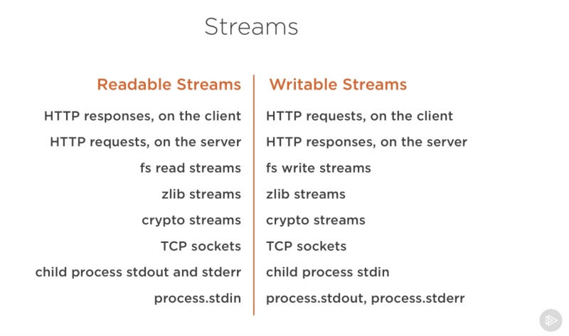

## 什么是流
Streams 是数据集合，就像数组或者 strings。区别在于 Streams 并不是立马得到全部的数据。所以 Streams 特别适合用于处理大的数据，或者处理 chunk 数据。
Node 中的许多内置模块都继承了 Streams 接口。比如：

上面这张图列出了一些内置模块，当中包含了 `Readable Streams` 和 `Writable Streams`。有我们处理 web 常见的 `HTTP responses`、`HTTP request` 以及读写文件的模块等。

## Streams 四种类型
* Readable - 可读操作
* Writable - 可写操作
* Duplex - 可读可写操作
* Transform - 操作被写入的数据，然后读出结果

所有的 Stream 对象 都是 EventEmitter 的实例。常用的事件有：
* data - 当有数据可读时触发
* end - 没有更多数据时触发
* error - 在接受和写入过程中发生错误时触发
* finish - 所有数据已被写入到底层系统时触发

## 从流中读取数据
```javascript
/**
 * 从流中读取文件
 */
const fs = require('fs');
let data = '';

// 创建可读流
const readerStreams = fs.createReadStream('../../data/data.txt');

readerStreams.setEncoding('utf8');

// 处理流事件 -> data, end and error
readerStreams.on('data', (chunk) => {
    data += chunk;
})

readerStreams.on('end', () => {
    console.log(data);
})

readerStreams.on('error', (error) => {
    console.log(error);
})

console.log('finish');

```

## 写入数据到流
```javascript
const fs = require('fs');
const file = fs.createWriteStream('./data/big.file');

for(let i = 0; i<=1e6; i++){
    file.write('Lorem ipsum dolor sit amet, consectetur adipisicing elit, sed do eiusmod tempor incididunt ut labore et dolore magna aliqua. Ut enim ad minim veniam, quis nostrud exercitation ullamco laboris nisi ut aliquip ex ea commodo consequat. Duis aute irure dolor in reprehenderit in voluptate velit esse cillum dolore eu fugiat nulla pariatur. Excepteur sint occaecat cupidatat non proident, sunt in culpa qui officia deserunt mollit anim id est laborum.\n')
}
file.end();
```

## Pipe 管道流
单纯使用 Streams 来进行读写大文件的时候，会占用较高的内存。
管道 Pipe 提供了一个输出流到输入流的机制。通常我们用于从一个流中获取数据并传递到另外一个流中。
下面的例子显示如何利用流，读取一个文件的内容写入到另外一个文件中。

```javascript

const fs = require('fs');

const readStreams = fs.createReadStream('../../data/data.txt');
const writeStreams = fs.createWriteStream('../../data/output.txt');

readStreams.pipe(writeStreams);
console.log('程序执行结束');
```
## 链式流
链式是**通过连接输出流到另外一个流并创建多个对多个流操作链的机制**。链式流一般用于 Pipe 操作。
下面的例子显示如何利用 Pipe 和 链式流来压缩和解压文件.

```javascript
const fs = require('fs');
const zlib = require('zlib');

fs.createReadStream('../../data/data.txt')
    .pipe(zlib.createGzip())
    .pipe(fs.createWriteStream('../../data/input.txt.gz'));

console.log('文件压缩完成');

```


## 拓展
* [Node.js Streams: Everything you need to know](https://medium.freecodecamp.com/node-js-streams-everything-you-need-to-know-c9141306be93)