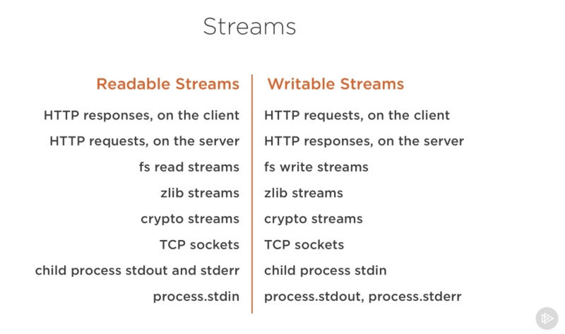

## 什么是流
Streams 是数据集合，就像数组或者 strings。区别在于 Streams 并不是立马得到全部的数据。所以 Streams 特别适合用于处理大的数据，或者处理 chunk 数据。
Node 中的许多内置模块都继承了 Streams 接口。比如：

上面这张图列出了一些内置模块，当中包含了 `Readable Streams` 和 `Writable Streams`。有我们处理 web 常见的 `HTTP responses`、`HTTP request` 以及读写文件的模块等。

## Streams 四种类型
* Readable - 可读操作
* Writable - 可写操作
* Duplex - 可读可写操作
* Transform - 操作被写入的数据，然后读出结果

所有的 Stream 对象 都是 EventEmitter 的实例。常用的事件有：
* data - 当有数据可读时触发
* end - 没有更多数据时触发
* error - 在接受和写入过程中发生错误时触发
* finish - 所有数据已被写入到底层系统时触发

## 从流中读取数据
